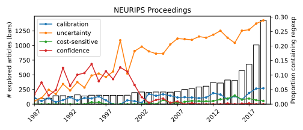

# Proceedings Scraper #
Scrap proceedings from the web and search them with a regular expression. Currently the package support AAAI, MLR/ICML and NIPS proceedings format.

# Example NeurIPS

The code in examples "scrap_proceedings.py" accepts a list of arguments for
which to search certain words in all the volumes of the specified proceedings.

```bash
python scrap_proceedings.py neurips aaai
```

The resulting figures look like the following:



# To Do #
- [ ] Fix ligatures handling in the pdf reader (e.g. [here](https://superuser.com/questions/165073/is-it-possible-to-remove-ligatures-from-copied-text))
